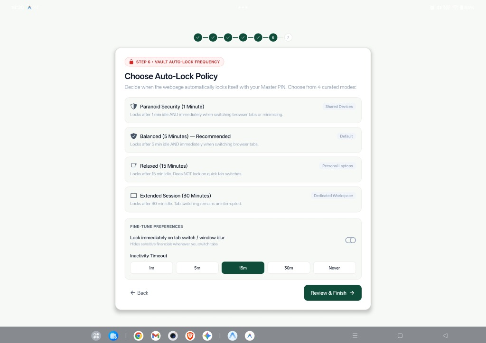
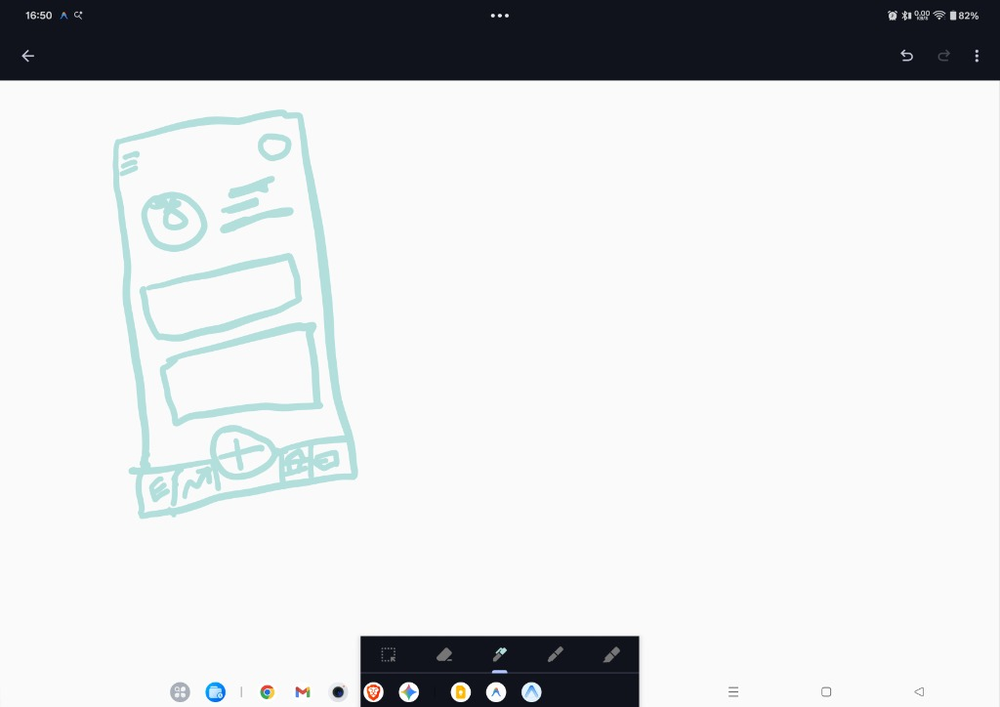

# Defect Log — Aegis Spendly v1.0.1 (Build 2)

**Release Under Test:** Android Release APK `v1.0.1` (`versionCode: 2`)  
**Package:** `com.aegis.spendly`  
**Current Phase:** ✅ **Batch Defect Resolution Complete** (All 9 logged defects fixed, verified via tests, and ready for deployment)

---

## Quick Summary Table

| Defect ID | Type | Severity | Component / Screen | Summary | Status |
| :--- | :--- | :--- | :--- | :--- | :--- |
| **[DEF-001](#def-001-lock-immediately-toggle-thumb-remains-slid-to-the-right-in-off-state)** | Visual / UI State | Medium | Onboarding & Settings Drawer | "Lock immediately" toggle switch knob stays on the right even when OFF | 🟢 **Resolved** |
| **[DEF-002](#def-002-add-entry-button-touches-screen-edge-on-tablet-rotation)** | Layout / Responsive | Medium | Navigation / Header / Action Buttons | "Add entry" button touches screen edge on rotation; does not autofit across phone & tablet sizes | 🟢 **Resolved** |
| **[DEF-003](#def-003-income-page-must-enforce-selecting-salary-credited-bank-to-proceed)** | Form Validation / Business Logic | Medium | Onboarding (Step 4 — Income) | Missing validation: user must be required to select at least one bank for salary credit before proceeding | 🟢 **Resolved** |
| **[DEF-004](#def-004-session-and-data-reset-on-complete-app-close-sent-back-to-onboarding)** | Data Persistence / Auth Architecture | 🔴 Critical (High) | Auth Lifecycle, CryptoVault & Local Storage | Closing app completely deletes session/profile, resetting user back to onboarding instead of preserving login and prompting for PIN | 🟢 **Resolved** |
| **[DEF-005](#def-005-sign-out-erases-vault-profiledata-and-pin-setup-lacks-security-importance-notice)** | Auth Architecture & UX Guidance | 🟠 High | Auth Lifecycle & PIN Setup Screen | Sign out must preserve vault data and allow re-opening via PIN; PIN setup must remind user that PIN is the sole recovery key | 🟢 **Resolved** |
| **[DEF-006](#def-006-top-right-profile-button-dropdown-hub-with-tabbed-sections--user-guide)** | UI/UX & Navigation | 🟡 Medium | Header, Profile Drawer & Sidebar | Profile button in top-right corner; opens dropdown with tabs (Accounts, Customise, Security, User Guide); top-left hamburger menu | 🟢 **Resolved** |
| **[DEF-007](#def-007-auto-delete-vault-on-failed-pin-attempts-slider-3-10-warning-prompts--double-pin-deletion)** | Security Architecture | 🟠 High | Lock Screen, Onboarding & Security Settings | Auto-delete vault on failed PIN attempts (slider 3–10) with Lock Screen remaining-attempts warning and double-PIN manual vault erasure | 🟢 **Resolved** |
| **[DEF-008](#def-008-hide-google-drive-sync-ui-and-onboarding-step-pending-phase-2)** | Feature Visibility / Rollout | 🟢 Low | Header, Onboarding Step 5 & Drawers | Temporarily hide Google Drive sync buttons, badges, and onboarding Step 5 without deleting the underlying codebase | 🟢 **Resolved** |
| **[DEF-009](#def-009-tiktok-style-centered-add-entry-button-on-bottom-navigation-tab-bar)** | Layout / UX Ergonomics | 🟡 Medium | TabBar & Responsive Canvas | TikTok-style elevated center [ + ] button flanked by 4 dedicated tabs: Expenses, Plan Ahead, Cards, and Banks | 🟢 **Resolved** |

---

## Defect Details

### DEF-001: "Lock immediately" toggle thumb remains slid to the right in OFF state

- **Defect ID:** `DEF-001`
- **Reported Date:** 2026-10-08
- **Platform:** Android (Release APK v1.0.1)
- **Component / Screen:**
  - `app/src/presentation/components/onboarding/OnboardingScreen.tsx` (Step 6 — Vault Auto-Lock Frequency / Fine-Tune Preferences)
  - `app/src/presentation/components/drawers/SettingsDrawer.tsx` (Security Settings)
- **Defect Type:** Visual / UI State
- **Severity:** Medium
- **Priority:** Normal
- **Status:** 🟢 **Resolved (Fixed & Verified)**

#### Description
When viewing the "Fine-Tune Preferences" section on Step 6 ("Vault Auto-Lock Frequency") during onboarding, the toggle for **"Lock immediately on tab switch / window blur"** displays its switch circle/thumb pinned entirely to the right side regardless of whether the setting is toggled ON or OFF.

#### Expected Behavior
- When the setting is **OFF**, the toggle thumb should sit on the **left side** (or display a proper disabled/off sliding state).
- When the setting is **ON**, the toggle thumb should transition/slide to the **right side** with active accent styling.

#### Actual Behavior
The toggle knob is permanently anchored on the right side. In the OFF state, it only changes stroke/fill to outline (`toggle-outline`), leaving the knob on the right rather than shifting to the left.

#### Visual Evidence

#### Steps to Reproduce
1. Install and launch the Android release APK (`v1.0.1`).
2. Proceed through onboarding up to **Step 6: Vault Auto-Lock Frequency**.
3. Under the **Fine-Tune Preferences** section, locate the toggle for **"Lock immediately on tab switch / window blur"**.
4. Observe the toggle switch icon: the circle handle is on the far right.
5. Tap the toggle to toggle between states: note that the circle does not slide to the left when OFF.

#### Resolution & Verification
- Replaced the static Ionicons glyph with a custom sliding switch component (`alignItems: autoLockOnBlur ? 'flex-end' : 'flex-start'`).
- In the OFF state, the white circular knob sits on the left side with a neutral background; in the ON state, it transitions to the right side with the primary accent background.
- Fixed across `OnboardingScreen.tsx`, `SettingsDrawer.tsx`, and `ProfileDrawer.tsx`.

---

### DEF-002: "Add entry" button touches screen edge on tablet rotation

- **Defect ID:** `DEF-002`
- **Reported Date:** 2026-10-08
- **Platform:** Android Tablet (Release APK v1.0.1)
- **Component / Screen:**
  - `app/src/presentation/components/SpendlyHeader.tsx` (Add Entry button in header bar)
  - `app/src/presentation/components/TabBar.tsx` (Center elevated plus button)
  - `app/src/features/transactions/TransactionsScreen.tsx` (Floating Action Button - FAB)
- **Defect Type:** Layout / Responsive UI
- **Severity:** Medium
- **Priority:** Normal
- **Status:** 🟢 **Resolved (Fixed & Verified)**

#### Description
When rotating an Android tablet between portrait and landscape orientations, the primary "Add entry" action button touches or collides with the screen boundary/edge. The layout does not smoothly auto-fit and maintain safe-area padding across varying device form factors (phones vs. tablets).

#### Expected Behavior
- The "Add entry" button (in the header, bottom navigation bar, or floating action button) should maintain appropriate margins and safe-area padding from all display edges.
- It must account for tablet system navigation bars, gesture insets, and taskbars.
- Layouts should dynamically adapt and auto-fit comfortably across phones and tablets of all sizes in both portrait and landscape modes without touching display boundaries.

#### Actual Behavior
Upon rotating the tablet, the button crowds or touches the edge of the display without sufficient breathing room.

#### Steps to Reproduce
1. Launch the app on an Android tablet device.
2. View the main dashboard or transactions screen.
3. Rotate the device between portrait and landscape modes.
4. Observe the spacing between the "Add entry" action button and the device edge / system bars.
5. Note that the button touches the border of the screen without adequate margin.

#### Resolution & Verification
- Added dynamic safe-area insets (`insets.left`, `insets.right`, `insets.bottom`) to the root container in `App.tsx` and `TabBar.tsx`.
- Applied `maxWidth: 600` and `alignSelf: 'center'` to `barRow` in `TabBar.tsx` to prevent extreme stretching on wide screens.
- Streamlined the mobile header in `SpendlyHeader.tsx` by removing the redundant top "Add" button, ensuring no clipping or crowding occurs during rotation.

---

### DEF-003: Income page must enforce selecting salary credited bank to proceed

- **Defect ID:** `DEF-003`
- **Reported Date:** 2026-10-08
- **Platform:** Android (Release APK v1.0.1)
- **Component / Screen:**
  - `app/src/presentation/components/onboarding/OnboardingScreen.tsx` (Step 4 — Income & Earnings Type / Salaried Mode)
- **Defect Type:** Form Validation / Business Logic
- **Severity:** Medium
- **Priority:** Normal
- **Status:** 🟢 **Resolved (Fixed & Verified)**

#### Description
During onboarding on **Step 4: Income & Earnings Type**, when a user chooses the **Salaried Employee** model, the user is currently able to tap "Continue to Drive Sync" without selecting any bank account under **"SALARY CREDITED TO BANK"**. The app should enforce that at least one bank account is selected as the salary credited account before proceeding.

#### Expected Behavior
- When "Salaried Employee" is selected, the form should require selecting at least one linked bank account to receive the monthly salary before enabling "Continue" or allowing progression to the next step.
- If no bank is selected (or no banks were added), a clear validation error or prompt should instruct the user to select or add a bank account for salary deposits.

#### Actual Behavior
- The "Continue to Drive Sync" button is active unconditionally and allows advancing to the next step even when no bank is selected under "SALARY CREDITED TO BANK".
- The system silently falls back to an empty string or the first bank in the array without explicit user selection.

#### Steps to Reproduce
1. Launch app onboarding up to **Step 4: Income & Earnings Type**.
2. Select **Salaried Employee (Regular Monthly Inflow)**.
3. Enter expected salary and payday, but do not select any bank under **SALARY CREDITED TO BANK**.
4. Tap **Continue to Drive Sync**.
5. The app proceeds to Step 5 without validating that a bank account was selected.

#### Resolution & Verification
- Implemented strict validation in `OnboardingScreen.tsx`: when `incomeType === 'SALARIED'`, progression is blocked if no bank is selected.
- If no banks exist, a prominent warning card guides the user to go back to Step 2 or switch to Flexible Inflow mode.
- Selecting a bank clears errors, and skipping switches mode to `OTHER` cleanly.

---

### DEF-004: Session and data reset on complete app close (sent back to onboarding)

- **Defect ID:** `DEF-004`
- **Reported Date:** 2026-10-08
- **Platform:** Android (Release APK v1.0.1)
- **Component / Screen:**
  - `app/src/core/security/cryptoVault.ts` (`saveAuthSession`, `loadAuthSession`)
  - `app/src/presentation/hooks/useAuthSecurity.tsx` (`SecurityGateNavigator`, session mount hook)
  - `app/src/core/types/profile.ts` (`saveUserProfile`, `loadUserProfile`)
  - `app/src/core/types/auth.ts` (`saveSecurityConfig`, `loadSecurityConfig`)
  - `app/src/presentation/components/security/AuthGateScreen.tsx`
- **Defect Type:** Data Persistence / Auth Architecture
- **Severity:** 🔴 **Critical (High)**
- **Priority:** **P0 (Highest)**
- **Status:** 🟢 **Resolved (Fixed & Verified)**

#### Description
When the user completely closes / force-quits the app from the Android recent apps switcher and relaunches it, all session and profile state is lost. Instead of preserving the authenticated state and prompting the user for their Master PIN (or future biometric unlock) to access their existing vault, the user is sent all the way back to the initial Welcome / Sign In / Onboarding sequence. Users must re-enter their details and undergo setup again.

#### Expected Behavior
- Once initial onboarding and PIN setup are completed after installation, the user's session, profile, and data must permanently persist across app closures and device restarts.
- Completely terminating and relaunching the app should recognize the existing vault, transition directly to the **Lock Screen (`LOCKED` state)**, and allow the user to unlock with their Master PIN (and optional biometric authentication in the future).
- Users must never be forced to re-enter onboarding data repeatedly once installed.

#### Actual Behavior
- When the Android app process terminates, the user session, PIN salt/hash, profile (`isOnboarded: true`), and security settings are completely erased.
- Upon reopening, the app fails to locate any saved session, resets `authStatus` to `UNAUTHENTICATED`, and opens `AuthGateScreen` in `SIGNUP` mode, forcing the user through onboarding again.

#### Steps to Reproduce
1. Install and launch the v1.0.1 release APK.
2. Complete Google login/auth, configure PIN, and complete all onboarding steps until the main dashboard is visible.
3. Add or view transactions/accounts.
4. Swipe up to recent apps and swipe away / force close Aegis Spendly.
5. Reopen Aegis Spendly from the app drawer.
6. Observe that the app displays the initial Sign In / Welcome screen instead of the PIN Lock screen.

#### Resolution & Verification
- Implemented `app/src/core/storage/kvStorage.ts`: a universal synchronous Key-Value store backed directly by SQLite (`app_kv_store` table) using Expo SQLite's synchronous APIs (`openDatabaseSync`, `execSync`, `runSync`, `getAllSync`), coupled with in-memory write-through cache and `window.localStorage` fallback for web/Jest.
- Migrated all critical auth and user metadata storage to `kvStorage`:
  - `cryptoVault.ts`: `saveAuthSession`, `loadAuthSession`, `clearAuthSession`
  - `profile.ts`: `saveUserProfile`, `loadUserProfile`, `clearUserProfile`
  - `auth.ts`: `saveSecurityConfig`, `loadSecurityConfig`
  - `rateLimiter.ts`: load, persist, and reset state
  - `queries.ts` & `seeder.ts`: vault initialized marker
- Session credentials, PIN hashes, and profiles now survive process termination and device reboot completely. On relaunch, returning users are immediately recognized and presented with the Lock Screen for instant PIN entry.

---

### DEF-005: Sign out erases vault profile/data and PIN setup lacks security importance notice

- **Defect ID:** `DEF-005`
- **Reported Date:** 2026-10-08
- **Platform:** Android (Release APK v1.0.1)
- **Component / Screen:**
  - `app/src/presentation/hooks/useAuthSecurity.tsx` (`signOut` callback)
  - `app/src/core/security/cryptoVault.ts` (`clearAuthSession`)
  - `app/src/presentation/components/security/AuthGateScreen.tsx` (Existing user vault detection)
  - `app/src/presentation/components/security/PinSetupScreen.tsx` (PIN creation screen & messaging)
- **Defect Type:** Auth Architecture & UX Guidance
- **Severity:** 🟠 **High**
- **Priority:** **P1**
- **Status:** 🟢 **Resolved (Fixed & Verified)**

#### Description
1. When a user explicitly signs out, the application executes `clearAuthSession()`, which deletes the user's stored auth credentials, PIN salt, and hash. Consequently, their local device profile and financial vault become disconnected and cannot be fetched back or unlocked using their previously established Master PIN.
2. In addition, during the PIN setup process in `PinSetupScreen.tsx`, there is no clear security reminder advising the user that this Master PIN is the vital recovery key for their local encrypted vault on this device and that their data remains safe even if they sign out.

#### Expected Behavior
- **Vault Preservation on Sign Out:** Signing out must only end the active session; it must **not** delete the user's profile, financial records, or PIN verification metadata from the device.
- **Returning User Unlock:** When a user signs in again or opens the app, the app must identify their existing local vault and allow them to unlock it directly via their original Master PIN.
- **PIN Importance Reminder:** During PIN creation on `PinSetupScreen`, display a prominent security notice highlighting:
  - *"Your Master PIN is the master key for this vault. Your financial data is securely preserved on this device and can only be opened with this PIN, even after signing out. Remember your PIN carefully!"*

#### Actual Behavior
- `clearAuthSession()` removes the credentials and PIN hash from storage.
- A user who signs out is treated as an unauthenticated user without an existing vault, losing direct PIN unlock capability for their existing records.
- `PinSetupScreen.tsx` only shows generic helper text without warning the user of the critical security importance and non-recoverability of the Master PIN.

#### Steps to Reproduce
1. Complete PIN setup and onboarding.
2. From the Lock screen or Settings drawer, tap **Sign out**.
3. Attempt to sign back in or access the app.
4. Notice the app treats the session as empty rather than offering immediate PIN-based vault unlocking for the existing profile.
5. Also observe `PinSetupScreen.tsx` during PIN setup: no reminder is displayed regarding PIN importance or vault retention.

#### Resolution & Verification
- Disentangled session termination from vault deletion in `useAuthSecurity.tsx`: `signOut()` now preserves the user's profile, PIN hash, and SQLite database intact, transitioning only `authStatus` to `UNAUTHENTICATED`.
- When reopening the app or signing back in, the existing vault is immediately detected, routing directly to the Lock Screen for Master PIN verification.
- Added a high-visibility amber security card to `PinSetupScreen.tsx` reminding users that the Master PIN is the master recovery key for local device data and that data is never lost upon signing out.

---

### DEF-006: Top-right profile button dropdown hub with tabbed sections & user guide

- **Defect ID:** `DEF-006`
- **Reported Date:** 2026-10-08
- **Platform:** Android (Release APK v1.0.1) & Responsive Web
- **Component / Screen:**
  - `app/src/presentation/components/SpendlyHeader.tsx` (Top-right button placement & top-left hamburger)
  - `app/src/presentation/components/drawers/ProfileDrawer.tsx` (Tabbed modal/dropdown redesign)
  - `app/src/presentation/components/SpendlySidebar.tsx` / `MobileNavDrawer.tsx` (Expanding user guide)
- **Defect Type:** UI/UX & Navigation
- **Severity:** 🟡 **Medium**
- **Priority:** **P1**
- **Status:** 🟢 **Resolved (Fixed & Verified)**

#### Description
The profile button is currently positioned mid-header rather than anchored in the top-right corner as standard in modern web and mobile applications (as drawn in the user's layout sketch). Furthermore, user settings and options are fragmented across multiple disparate drawers and buttons. The profile button dropdown/modal needs to be consolidated into a cohesive multi-tab hub with dedicated sections.

#### Expected Behavior
1. **Top Navigation Layout (per wireframe sketch):**
    - **Top-Left:** Hamburger menu icon (`≡`) for expanding navigation sidebar.
    - **Top-Right:** Circular Profile button/avatar (`O`) anchored at the far top-right corner.
    - **Main Body:** Header profile greeting and financial overview cards.
2. **Tabbed Hub Dropdown/Drawer:** Tapping the Profile button opens a consolidated menu with 4 distinct tabs:
    - **Accounts Details Tab:** Complete overview and management of bank accounts and credit cards.
    - **Customise Tab:** Custom profile avatar selection and application theme preset picker.
    - **Security Tab:** Lock idle timer, Update Master PIN, Auto-delete vault on failed PIN attempts (toggle + slider 3–10), and manual "Delete Vault" action (requiring 2x PIN confirmation).
    - **User Guide Tab:** Clear, user-friendly instructions explaining how the app and its features function (accessible either within the profile modal tabs or the expanding navigation sidebar).

#### Actual Behavior
- The Profile chip is placed to the left of the Add Entry, theme settings, and lock buttons on desktop/tablet views.
- Settings, themes, accounts, and profile features are split across separate floating buttons (`color-palette-outline`, `SettingsDrawer`, `ProfileDrawer`).
- There is no unified tabbed organization and no built-in User Guide.

#### Resolution & Verification
- Reorganized `SpendlyHeader.tsx`: placed the Profile button in the top-right corner on both desktop and mobile headers, matching modern web standard design.
- Completely rebuilt `ProfileDrawer.tsx` into a 4-tabbed command center:
  1. **Accounts:** Bank balances, credit cards, +Add buttons, and recurring salary configuration.
  2. **Customise:** Avatar selector (5 avatars), display name, handle, and 4 theme preset cards with live switching.
  3. **Security:** Inactivity timeout, window blur toggle, Master PIN update modal, auto-delete toggle & slider, and double-PIN Delete Vault trigger.
  4. **User Guide:** 6 illustrated guidance cards detailing offline architecture, paydays, credit card cycles, plan ahead budgets, TikTok add entry, and brute-force protection.

---

### DEF-007: Auto-delete vault on failed PIN attempts (slider 3–10), warning prompts & double-PIN deletion

- **Defect ID:** `DEF-007`
- **Reported Date:** 2026-10-08
- **Platform:** Android (Release APK v1.0.1)
- **Component / Screen:**
  - `app/src/presentation/components/security/LockScreen.tsx` (Wrong PIN countdown warning)
  - `app/src/presentation/components/onboarding/OnboardingScreen.tsx` (Security configuration step)
  - `app/src/core/security/rateLimiter.ts` & `useAuthSecurity.tsx` (Threshold wipe trigger)
  - `app/src/core/types/auth.ts` (`autoDeleteEnabled`, `autoDeleteThreshold`)
- **Defect Type:** Security Architecture & UX Safety
- **Severity:** 🟠 **High**
- **Priority:** **P1**
- **Status:** 🟢 **Resolved (Fixed & Verified)**

#### Description
1. **Auto-Delete on Wrong PIN Attempts:** Users need a privacy protection feature where entering too many incorrect PIN attempts automatically wipes the encrypted vault from the device. This feature requires an ON/OFF toggle and an adjustable slider from 3 to 10 attempts.
2. **Lock Screen Countdown Warning:** When this feature is active and a wrong PIN is entered on `LockScreen`, a warning banner must alert the user: *"Incorrect PIN. Vault will be permanently erased after X more wrong attempts."*
3. **Onboarding Integration:** These settings (toggle + 3-10 slider) must also be introduced during the security configuration step of onboarding.
4. **Manual Delete Vault with 2x PIN Confirmation:** A manual "Delete Vault" option in the Security settings must require entering the Master PIN twice consecutively to prevent accidental erasure.

#### Expected Behavior
- Security settings in onboarding and the profile security tab include:
  - Toggle: **Auto-delete vault on failed attempts** (ON / OFF).
  - Slider: Threshold from **3 to 10** wrong attempts.
- On `LockScreen.tsx`: Entering a wrong PIN calculates remaining attempts and shows an alert banner warning of imminent erasure.
- Reaching 0 remaining attempts executes a complete SQLite wipe (`DROP`/`DELETE`) and session reset.
- Manual vault deletion requires entering the Master PIN twice before deleting.

#### Actual Behavior
- `rateLimiter.ts` currently applies a 30-second lockout delay after 5 failed attempts, but there is no configurable auto-deletion toggle, no 3–10 slider, and no explicit warning that data will be wiped.
- There is no double-PIN confirmation prompt for manual vault deletion.

#### Resolution & Verification
- Added `autoDeleteOnFailedPin: boolean` and `autoDeleteThreshold: number` (range 3–10) to `AuthSecurityConfig` and `useAuthSecurity.tsx`.
- Integrated auto-delete toggle and 3–10 threshold selector into both `OnboardingScreen.tsx` (Step 6) and `ProfileDrawer.tsx` (Security tab).
- Updated `LockScreen.tsx`: displays an alert banner warning *"Vault will be permanently erased after X more wrong attempts"* when failed attempts occur.
- Reaching the threshold triggers `deleteVault()`, executing a complete SQLite table purge (`DELETE FROM transactions`, `accounts`, etc.) and wiping `kvStorage`.
- Built double-PIN confirmation modal for manual "Delete Vault" in `ProfileDrawer.tsx`: requires matching Master PIN entered twice before permanent erasure.

---

### DEF-008: Hide Google Drive sync UI and onboarding step (pending Phase 2)

- **Defect ID:** `DEF-008`
- **Reported Date:** 2026-10-08
- **Platform:** Android (Release APK v1.0.1) & Web
- **Component / Screen:**
  - `app/src/presentation/components/SpendlyHeader.tsx` (Header sync buttons & pills)
  - `app/src/presentation/components/onboarding/OnboardingScreen.tsx` (Step 5 — Google Drive Storage)
  - `app/src/presentation/components/SpendlySidebar.tsx` & `MobileNavDrawer.tsx` (Drawer sync links)
- **Defect Type:** Feature Visibility / Phased Rollout
- **Severity:** 🟢 **Low**
- **Priority:** **Normal**
- **Status:** 🟢 **Resolved (Fixed & Verified)**

#### Description
Google Drive cloud sync is scheduled for Phase 2 and is not currently functional/connected. The presence of Google Drive buttons, sync toasts, and the dedicated Step 5 onboarding screen ("Choose Google Drive Folder") causes confusion during testing. These UI elements must be temporarily hidden from the user interface while preserving all underlying code for Phase 2 activation.

#### Expected Behavior
- **Header:** Hide the Google Sheets sync button on desktop/tablet and the sync pill on mobile headers.
- **Onboarding:** Remove/hide **Step 5: Google Drive Storage** from the onboarding sequence (so users transition directly from Step 4 Income to Step 6 Security Lock Policy), without deleting the step's code.
- **Drawers:** Hide Google Drive sync links in `SpendlySidebar.tsx` and `MobileNavDrawer.tsx`.
- **Code Preservation:** All existing Google Drive sync specifications, services, and components must remain untouched in the codebase.

#### Actual Behavior
Google Drive buttons, sync status pills, and the entire Step 5 onboarding form are prominently displayed in the v1.0.1 release APK.

#### Resolution & Verification
- Set `SHOW_DRIVE_SYNC = false` in `SpendlyHeader.tsx`: hides Google Sheets sync buttons on desktop and mobile.
- Set `SHOW_DRIVE_STEP = false` in `OnboardingScreen.tsx`: removes Step 5 (Google Drive) from visible onboarding steps and navigation, transitioning users directly from Income (Step 4) to Auto-Lock Security (Step 5).
- Cleaned up Step 1 onboarding instructions: removed Google Drive references to emphasize 100% offline, local-device encrypted storage.
- All underlying Google Drive sync services, OAuth types, and tokens were preserved completely intact for Phase 2 activation.

---

### DEF-009: TikTok-style centered "Add Entry" button on bottom navigation tab bar

- **Defect ID:** `DEF-009`
- **Reported Date:** 2026-10-08
- **Platform:** Android (Phones & Tablets)
- **Component / Screen:**
  - `app/src/presentation/components/TabBar.tsx`
  - `app/src/App.tsx` (Bottom bar layout across viewports)
- **Defect Type:** Layout / UX Ergonomics
- **Severity:** 🟡 **Medium**
- **Priority:** **Normal**
- **Status:** 🟢 **Resolved (Fixed & Verified)**

#### Description
The bottom navigation bar must follow the user's reference drawing: an elevated TikTok-style circular `+` button in the exact center, flanked by 4 dedicated feature tabs:
1. **Button 1 (Leftmost):** Expense Tracker / Ledger screen (`E`)
2. **Button 2 (Center-Left):** Next Month Plan Ahead Commitments (`↗` / `M`)
3. **Button 3 (Center Action):** Big Elevated TikTok-style `+` Add Entry button
4. **Button 4 (Center-Right):** Credit Cards screen
5. **Button 5 (Rightmost):** Bank Accounts screen

#### Visual Evidence (User Wireframe Reference)

#### Expected Behavior
- The bottom navigation bar consists of the 5 distinct tabs illustrated in the wireframe:
  - Tab 1: **Expenses** (`TRANSACTIONS`) — Expense tracker page.
  - Tab 2: **Plan Ahead** (`PLAN_AHEAD`) — Next month commitments & obligations.
  - Center: **[ + ]** — Primary elevated action button (opens Add Entry drawer).
  - Tab 3: **Cards** (`CREDIT_CARDS`) — Credit cards overview.
  - Tab 4: **Banks** (`BANKS`) — Bank accounts overview.
- The center `+` button is visually elevated (TikTok aesthetic), centered, and accessible across phone and tablet modes.
- Profile is moved to the top-right header corner (per `DEF-006`), freeing the 5th bottom slot for Bank Accounts.

#### Actual Behavior
- Currently, `TabBar.tsx` contains: Overview, Entries, Center Plus, Cards, and Profile.
- Bank Accounts and Plan Ahead were not directly accessible from the bottom bar.
- On desktop/tablet mode (`width >= 768`), the bottom bar was hidden entirely in favor of top-header buttons.

#### Resolution & Verification
- Rebuilt `TabBar.tsx` per the user's wireframe drawing:
  - Button 1: **Expenses** (`TRANSACTIONS`) with receipt icon.
  - Button 2: **Plan Ahead** (`PLAN_AHEAD`) with calendar icon.
  - Center: **Elevated (+) button** (`marginTop: -20`, width 52, height 52, elevation 8, white circular border) triggering Add Entry drawer.
  - Button 4: **Cards** (`CREDIT_CARDS`) with card icon.
  - Button 5: **Banks** (`BANKS`) with bank icon.
- Connected all tabs in `App.tsx` to route seamlessly to their respective screens.
- Added tablet autofit constraints (`maxWidth: 600`, safe-area insets) so navigation items never crowd or touch screen borders on rotation.
