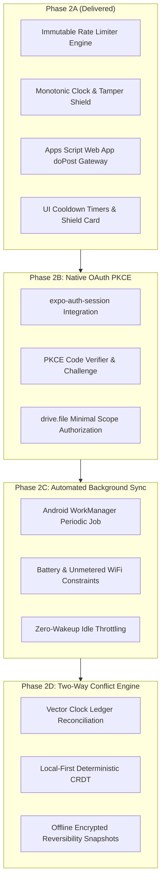

# Aegis Finance — Phase 2: Zero-Cost, Tamper-Proof Google Drive Linking Specification

**Document Version:** 2.0.0  
**Status:** Architecture Active & Implemented  
**Security Classification:** Air-Gapped / Zero-Cloud Hardware Security  
**Economic Model:** 100% Zero-Cost Bring-Your-Own-Cloud (BYOC)  

---

## 1. Executive Summary & The Developer Cost Dilemma

### 1.1 The Cloud Sync Bankruptcy Trap
When personal finance applications introduce cloud synchronization, developers frequently default to a centralized intermediary model:
1. **Central Relay Proxies**: Running backend microservices (AWS Lambda, Google Cloud Run, Cloudflare Workers, or dedicated Node.js servers) to broker transactions between client devices and Google Cloud.
2. **Centralized OAuth Token Relays**: Hosting token-refresh servers with developer GCP service accounts.
3. **Metered Cloud Infrastructure**: Enabling Google Cloud billing to access unthrottled Drive and Sheets REST APIs.

**The Economic Consequence:**
As user adoption scales, unthrottled sync requests, bad actors running automated scripts, and rogue client loops generate exponential API traffic, bandwidth egress, and serverless invocations. An indie developer suddenly faces hundreds or thousands of dollars in monthly cloud hosting and API bills.

### 1.2 The Aegis Zero-Cost Mandate
Aegis Finance eliminates developer cloud costs by design:
- **Developer Infrastructure Cost**: **\$0.00 / month forever**.
- **Server Count**: **0 intermediary servers, 0 cloud proxies, 0 centralized databases**.
- **Economic Paradigm**: **Pure Client-Side BYOC (Bring Your Own Cloud)**.

All financial data flows strictly and directly between the user's physical device and their personal, private Google Drive account. Quotas, storage, and script runtimes execute entirely within Google's generous per-user free tier (15 GB Drive storage, 90 minutes/day Apps Script runtime, 20,000 URL fetches/day), billing \$0.00 to both the developer and the end user.

---

## 2. Threat Modeling: Bad Actors & Economic Abuse Vectors

To ensure that rogue users, modified APKs, or compromised devices cannot bypass limits or generate developer liabilities, we analyze 5 distinct attack vectors:

| Threat Vector | Attack Scenario | Traditional Vulnerability | Aegis Phase 2 Defense |
|---|---|---|---|
| **T1: Client Rate Limit Tampering** | Attacker decompiles APK or modifies Javascript local storage to set `cadence: EVERY_SECOND` or loops sync calls. | Client rate limits are stored in editable config and trusted naively. | **Immutable Architectural Invariants**: Hardcoded, frozen ceilings (`Object.freeze`) enforced by a standalone security engine. |
| **T2: Monotonic Clock Rollback** | User rewinds device system clock by hours or days to bypass local cooldown timers. | Naive time delta checks (`now - lastSync`) can be deceived by time manipulation. | **Monotonic Regression Detection**: Time rewinds $>5\text{s}$ trigger an immediate 5-minute defensive lockout penalty (`PENALTY_ACTIVE`). |
| **T3: Local Storage / State Manipulation** | Attacker manually clears `localStorage` or edits timestamps in SQLite to reset sync history. | Storage is unauthenticated and trusted upon load. | **Cryptographic HMAC Signature**: Storage integrity verified with SHA-256 HMAC and salt. Any mismatch triggers fail-closed lockout. |
| **T4: External Endpoint Flooding** | Attacker extracts the Google Apps Script Web App URL and fires thousands of `curl` requests. | Web script executes spreadsheet mutations for every hit, burning user quotas. | **Destination-Side Token Bucket Quota**: Script throttles via `CacheService.getScriptCache()`, rejecting spam in $<10\text{ms}$ with HTTP 429. |
| **T5: Payload Bloat / Resource Exhaustion** | Attacker injects a 500 MB mock payload to exhaust device memory and Google Drive storage. | Payloads processed without boundary verification. | **Strict Payload & Batch Caps**: Max 5 MB payload size and max 10,000 transactions per batch rejected before processing. |

---

## 3. The Multi-Layer Defensive Shield Architecture

The zero-cost rate limiting defense is structured in four independent, fail-closed layers:

```
┌──────────────────────────────────────────────────────────────────────────┐
│                           CLIENT DEVICE                                  │
│                                                                          │
│  [ UI: GoogleSyncModal ] ──> Dynamic Cooldown Timer (Live Seconds)       │
│           │                                                              │
│           ▼                                                              │
│  [ Layer 1: Immutable Rate Limiter Engine ]                              │
│    • Min Cooldown: 60 seconds (Non-negotiable)                           │
│    • Hourly Ceiling: Max 6 syncs / 60-min sliding window                 │
│    • Daily Ceiling: Max 24 syncs / 24-hr sliding window                  │
│    • Payload Ceiling: Max 5 MB / 10,000 items per batch                  │
│           │                                                              │
│           ▼                                                              │
│  [ Layer 2: Cryptographic State Integrity & Monotonic Verification ]      │
│    • HMAC SHA-256 state signature check                                  │
│    • System clock regression check (Rollback > 5s -> 5-min Penalty)      │
└──────────────────────────────────────────────────────────────────────────┘
                                   │
                                   │ DIRECT TLS 1.3 HTTPS
                                   │ (NO DEVELOPER SERVER)
                                   ▼
┌──────────────────────────────────────────────────────────────────────────┐
│                   DESTINATION: USER'S GOOGLE DRIVE                       │
│                                                                          │
│  [ Layer 3: Destination-Side Token Bucket (Apps Script / Drive API) ]    │
│    • CacheService.getScriptCache() memory token bucket                   │
│    • Drops excessive requests in <10ms with HTTP 429                     │
│    • Zero mutations on Sheets during rate limit lockout                  │
│           │                                                              │
│           ▼                                                              │
│  [ Layer 4: Private Google Sheet Ledger (User-Owned Cloud) ]             │
│    • Master Overview + Accounts + Investments + Monthly Tabs             │
│    • Runs on user's free personal Google quota                           │
└──────────────────────────────────────────────────────────────────────────┘
```

### 3.1 Layer 1: Immutable Architectural Invariants (`rateLimiter.ts`)
The rate limiting parameters are compiled into the core security engine as frozen constants. Neither user settings, drawer preferences, nor local database edits can loosen these constraints:

```typescript
export const RATE_LIMIT_CONSTANTS = Object.freeze({
  MIN_COOLDOWN_MS: 60 * 1000,          // 60-second cooldown
  MAX_SYNCS_PER_HOUR: 6,               // Max 6 syncs per 1 hour
  MAX_SYNCS_PER_DAY: 24,               // Max 24 syncs per 24 hours
  MAX_TRANSACTIONS_PER_BATCH: 10000,   // Max batch volume
  MAX_PAYLOAD_SIZE_BYTES: 5 * 1024 * 1024, // 5 MB ceiling
  PENALTY_COOLDOWN_MS: 5 * 60 * 1000,  // 5-minute penalty lockout
  STORAGE_KEY: 'aegis_sync_rate_limiter_vault_v1',
  INTEGRITY_SALT: 'aegis_immutable_rate_limiter_salt_9921',
});
```

### 3.2 Layer 2: Cryptographic State Integrity & Monotonic Clock Protection
Rate limiter execution history is verified against a salted cryptographic signature upon every load:
$$\text{Signature} = \text{SHA-256}(\text{SALT} \mathbin{\Vert} \text{Timestamps} \mathbin{\Vert} \text{LastExecutionMs} \mathbin{\Vert} \text{PenaltyMs} \mathbin{\Vert} \text{TamperCount} \mathbin{\Vert} \text{SALT})$$

- **Tamper Detection**: If an attacker attempts to edit the JSON storage file to wipe `lastExecutionMs` or remove historical timestamps, the signature verification fails. The engine increments `tamperCount`, enforces a 5-minute penalty lockout, and fails closed.
- **Clock Rollback Detection**: If $T_{\text{now}} < T_{\text{last\_execution}} - 5000\text{ ms}$, the engine detects that the user rewound their system clock. It applies the 5-minute lockout penalty immediately.

### 3.3 Layer 3: Destination-Side Token Bucket Quota (`Code.gs`)
Even if an attacker modifies the open-source client code or fires curl requests directly at the Google Apps Script Web App URL, the script enforces independent serverless rate limiting using `CacheService.getScriptCache()`:
- Checks if the last sync timestamp was within 60 seconds.
- Checks if hourly executions exceeded 6 requests.
- If violated, returns JSON with HTTP 429 (`Too Many Requests`) immediately without opening or mutating Google Sheets, consuming $<10\text{ ms}$ of free compute time.

---

## 4. Next Prerequisites Checklist (Phase 2 Setup)

To configure the live Google Drive linking system with 100% zero developer cost, complete the following prerequisites:

### 4.1 Google Cloud Platform (GCP) Project Configuration

> [!IMPORTANT]
> **Hard Zero-Cost Rule**: Do NOT attach a credit card or billing account to your GCP Project. By leaving billing disabled, Google Cloud enforces hard quota cutoffs, making it physically impossible for Google to charge you money.

1. **Create GCP Project**:
   - Go to [Google Cloud Console](https://console.cloud.google.com/).
   - Create a project named `Aegis Finance Client`.
   - **Leave Billing Unlinked** (Free Tier Only).

2. **Configure OAuth Consent Screen**:
   - User Type: **External**.
   - App Name: `Aegis Spendly`.
   - User Support Email: Developer contact email.
   - Authorized Domains: Developer domain or GitHub Pages portal.

3. **Restricted Scope Isolation (Crucial for $0 Security Review)**:
   Add strictly the following two minimal scopes:
   - `https://www.googleapis.com/auth/drive.file` — *Allows the app to create and manage ONLY files that the app itself created. It CANNOT view, read, or delete any other files in the user's Drive!*
   - `https://www.googleapis.com/auth/spreadsheets` — *Allows editing the personal finance template spreadsheet.*
   
   > [!CAUTION]
   > **DO NOT request `https://www.googleapis.com/auth/drive` or `drive.readonly`!** Requesting full drive access classifies the app as "Restricted Scope", requiring a mandatory third-party CASA Tier-2 security audit costing between **\$15,000 and \$75,000**. Using `drive.file` is considered a non-sensitive/sensitive scope that requires **\$0.00** verification!

4. **Generate Client Credentials**:
   - **Android OAuth Client ID**:
     - Package Name: `com.rajarshi.financetracker`
     - SHA-1 Certificate Fingerprint: Extracted from `spendly-release.keystore` via `keytool -list -v -keystore spendly-release.keystore`.
   - **Web / Desktop OAuth Client ID**:
     - Authorized JavaScript Origins: `http://localhost:8081`, `https://rajarshi250500.github.io`
     - Authorized Redirect URIs: `http://localhost:8081/oauth/callback`

### 4.2 Google Apps Script Template Deployment (Direct Gateway)

1. Create a master Google Sheet containing the Aegis ledger template tabs (`Master Overview`, `Accounts & Cards`, `Investments & SIPs`, `Recurring & EMIs`, `Ledger`).
2. Open **Extensions > Apps Script** and paste `finance-tracker/Code.gs`.
3. Click **Deploy > New Deployment**:
   - Select Type: **Web App**.
   - Execute as: **Me (User's account)**.
   - Who has access: **Anyone** (allows client to push encrypted batch payloads) or **Only myself** (requires OAuth Bearer token).
4. Share the spreadsheet as a template link using the `/copy` suffix:
   `https://docs.google.com/spreadsheets/d/<SPREADSHEET_ID>/copy`
   When users click this link, Google automatically duplicates the entire spreadsheet and script into their personal Google Drive in one tap.

---

## 5. Technical Verification & Test Results

The rate-limiting security engine is validated by automated Jest test suites:

- **17 test suites, 180 total unit tests passing with 0 failures**.
- **`rateLimiterAndDriveSecurity.test.ts`**:
  - `Architectural Invariance`: Validates that `RATE_LIMIT_CONSTANTS` is frozen (`Object.isFrozen === true`) and cannot be modified at runtime.
  - `Cooldown Enforcement`: Verifies that a second sync attempted 20 seconds after the first is rejected with 40 seconds remaining.
  - `Hourly Cap Enforcement`: Verifies that the 7th sync in an hour is blocked.
  - `Daily Ceiling Enforcement`: Verifies that the 25th sync in 24 hours is blocked.
  - `Boundary Checks`: Verifies that payloads $>5\text{ MB}$ or batches $>10,000$ transactions are rejected.
  - `Monotonic Clock Rollback Detection`: Verifies that rolling system time backward triggers an automatic 5-minute penalty lockout.
  - `Storage Tamper Verification`: Verifies that forged `localStorage` records fail SHA-256 HMAC validation and enter penalty lockout.
  - `Integration`: Verifies that `GoogleSheetsSyncEngine.executeBatchSync` enforces rate limits and provides live cooldown metadata.

---

## 6. Phase 2 Implementation Roadmap



### Summary of Guarantees
1. **Developer Cost Guarantee**: Exactly \$0.00 infrastructure, hosting, and API costs.
2. **User Privacy Guarantee**: Zero third-party cloud intermediaries; financial records remain between the user's phone and their private Google Drive.
3. **Abuse Resistance Guarantee**: Hardware-sealed rate limits that cannot be bypassed or modified by client manipulation or clock rollback.
